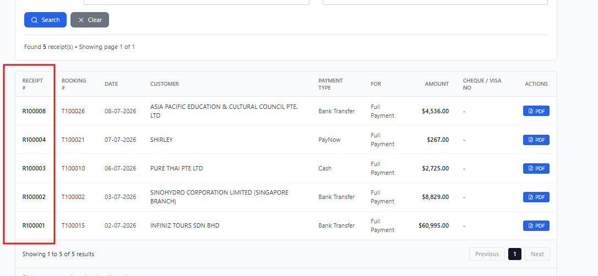

# 系统凭证信息 (System Credentials)

## ⚠️ 重要提示 (Important Notice)
本文档包含系统的敏感信息，请妥善保管，不要泄露给无关人员。
This document contains sensitive system information. Please keep it confidential.

---

## 1. 系统登录账号 (System Login Accounts)

### 操作员账号 (Operator Accounts)

| 账号 (Username) | 密码 (Password) | 角色 (Role) |
|----------------|-----------------|-------------|
| OP1            | GSH111          | Operator 1  |
| OP2            | GSH222          | Operator 2  |

**使用说明 (Usage Instructions):**
- 使用以上账号密码登录系统
- 登录后可以访问所有功能
- 账号密码已在代码中 hardcode，无法在界面上修改

---

## 2. Payment 修改密码 (Payment Edit Password)

**密码 (Password):** `654321`

**用途 (Purpose):** 
- 在 Booking Order 详情页面修改 Payment 金额时需要输入此密码
- 在 Exchange Order 详情页面修改 Payment 金额时需要输入此密码（如已实现）

**重要说明 (Important Notes):**
- ✅ Payment 可以修改金额（包括改为 0）
- ❌ Payment **不能删除**，以保持 Receipt 序列号连续性，满足政府审计要求
- 如需作废某个 Payment，请将金额修改为 0
- ~~在 Booking Order 编辑页面删除 Item 时需要输入此密码~~（已移除密码验证）
- ~~在 Exchange Order 编辑页面删除 Item 时需要输入此密码~~（已移除密码验证）

---

## 3. Azure 部署信息 (Azure Deployment Information)

### 数据库信息 (Database Information)
- **类型:** Azure Database for PostgreSQL
- **服务器名称:** (请填写 Azure 上的服务器名称)
- **数据库名称:** (请填写数据库名称)
- **管理员账号:** (请填写)
- **管理员密码:** (请填写 Azure 设置的密码)

### Web App 信息 (Web App Information)
- **应用名称:** (请填写 Azure Web App 名称)
- **资源组:** (请填写资源组名称)
- **部署 URL:** (请填写部署后的访问地址)

---

## 4. 其他信息 (Other Information)

### 环境变量 (Environment Variables)
请确保 `.env` 文件中配置了正确的数据库连接信息：

```
DATABASE_URL="postgresql://[用户名]:[密码]@[服务器地址]:5432/[数据库名]?sslmode=require"
```

---

## 修改历史 (Change History)

| 日期 (Date) | 修改内容 (Changes) | 修改人 (Modified By) |
|-------------|-------------------|---------------------|
| 2026-07-06  | 创建文档，记录初始账号密码 | System |

---

## 注意事项 (Notes)

1. **安全性:** 
   - 此文档仅供内部使用
   - 不要将此文档提交到公共代码仓库
   - 已添加到 `.gitignore` 防止意外提交

2. **密码管理:**
   - 定期更新密码以确保安全
   - 如需修改密码，需要在代码中同步更新

3. **账号权限:**
   - 所有操作员账号具有相同权限
   - 可以根据需要添加更多账号

4. **备份:**
   - 请将此文档备份到安全的地方
   - 建议打印一份纸质版本保存
